# Conversation Summary with SuperClaude

This document summarizes our recent interaction, covering the analysis of the SuperClaude project and an exploration of its capabilities.

## 1. Project Analysis & Synopsis

We began by performing an end-to-end analysis of the SuperClaude project.

**Key Findings:**

*   **Dual Architecture:** The project consists of a Python-based management CLI for installation/updates and a unique "logic layer" defined by Markdown files.
*   **Prompt-Driven Logic:** The core AI's behavior is guided by a sophisticated set of Markdown files in the `SuperClaude/` directory, which act as prompts and configurations for a large language model.
*   **Key Directories:**
    *   `Docs/`: User-facing documentation.
    *   `SuperClaude/`: The "soul" of the AI, containing definitions for commands, personas, and core principles.
    *   `SuperClaude.py`: The management CLI entry point.
    *   `setup/`: Python package containing the implementation logic for the CLI.
    *   `profiles/`: Different JSON-based installation profiles.

## 2. Workflow Simulation: "Eye-Catching Website"

We simulated the end-to-end workflow for creating an "eye-catching front-end website."

**Workflow Diagram:**

```mermaid
graph TD
    A[💡 Ideation & Brainstorming] --> B[🏗️ Architectural Design];
    B --> C[🎨 UI/UX Implementation];
    C --> D[⚙️ Build & Synthesis];
    D --> E[🧪 Testing & Improvement];

    subgraph "Commands & Focus"
        A ---|"/ideate --focus 'visual concepts'"| A;
        B ---|"/design --persona architect --plan"| B;
        C ---|"/implement --persona frontend --magic"| C;
        D ---|"/build --optimize performance"| D;
        E ---|"/test --play"| E;
        E ---|"/improve --focus performance --loop"| E;
    end

    style A fill:#A2242C,stroke:#333,stroke-width:2px,color:#fff
    style B fill:#333,stroke:#A2242C,stroke-width:2px,color:#fff
    style C fill:#333,stroke:#A2242C,stroke-width:2px,color:#fff
    style D fill:#333,stroke:#A2242C,stroke-width:2px,color:#fff
    style E fill:#333,stroke:#A2242C,stroke-width:2px,color:#fff
```

**Workflow Stages:**

| Stage | Command | Flags & Personas | MCP Preference |
| :--- | :--- | :--- | :--- |
| **Ideation** | `/ideate` | `--focus 'visual concepts'` | **Magic** |
| **Design** | `/design` | `--persona architect`, `--plan` | **Sequential** |
| **Implementation**| `/implement`| `--persona frontend`, `--magic`| **Magic** |
| **Build** | `/build` | `--optimize performance` | **Context7** |
| **Testing** | `/test` & `/improve`| `--play`, `--focus accessibility`| **Playwright** |

## 3. Comprehensive Flag Reference

We explored the full range of available flags to customize SuperClaude's behavior.

**Key Flag Categories:**

*   **Planning & Analysis:** `--plan`, `--think`, `--think-hard`, `--ultrathink`, `--explain`, `--creative`, `--level`.
*   **Efficiency & Control:** `--uc`, `--safe-mode`, `--validate`, `--verbose`, `--answer-only`.
*   **MCP Servers:** `--c7`, `--seq`, `--magic`, `--play`, `--all-mcp`, `--no-mcp`.
*   **Focus & Scope:** `--scope`, `--focus`, `--persona-[name]`.

## 4. Testing & Ideating Workflows

We discussed how to safely test and ideate new workflows without full execution.

**Primary Testing Methods:**

1.  **`--plan`:** Preview the execution steps, activated personas, and tools without running the command. This is the best way to test an idea.
2.  **`--answer-only`:** Get a direct response from a command without triggering a multi-step task workflow. Ideal for quick, isolated tests.
3.  **Introspection Flags (`--introspect`, `--explain`, `--verbose`):** Understand the *reasoning* behind a plan or execution.

**Recommended Testing Loop:**

```mermaid
graph TD
    A[💡 **1. Have an Idea**<br/>e.g., 'A new dashboard'] --> B[🧪 **2. Formulate & Test Command**<br/>/design 'new dashboard' --plan];
    B --> C{📝 **3. Review Plan**<br/>Does it match your intent?};
    C -- No --> D[🔄 **4. Refine Command**<br/>Add --focus, --persona, or change prompt];
    D --> B;
    C -- Yes --> E[🚀 **5. Execute Command**<br/>Remove --plan and run];

    subgraph "Testing Tools"
        B -- "--introspect<br/>--explain" --> C
    end

    style A fill:#A2242C,stroke:#333,stroke-width:2px,color:#fff
    style B fill:#333,stroke:#A2242C,stroke-width:2px,color:#fff
    style C fill:#333,stroke:#A2242C,stroke-width:2px,color:#fff
    style D fill:#333,stroke:#A2242C,stroke-width:2px,color:#fff
    style E fill:#4CAF50,stroke:#333,stroke-width:2px,color:#fff
```

1.  **Formulate Command:** Create your command with the desired flags and add `--plan`.
2.  **Review Plan:** Check if the output matches your intent.
3.  **Refine Command:** If the plan isn't right, adjust the flags, persona, or prompt and re-run with `--plan`.
4.  **Execute:** Once you're satisfied with the plan, remove `--plan` and run the command.

This summary should serve as a useful reference for our discussion. 